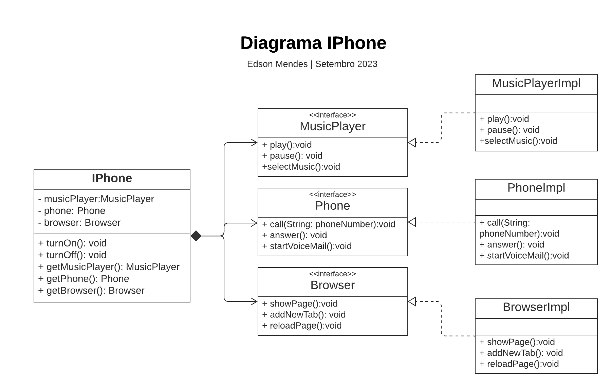

# Desafio DIO de POO em Java

## Resumo

Repositório resposta para o desafio de Modelagem e diagramação da representação em UML e Código no que se refere ao componente iPhone.

Desafio proposto pela [DIO](https://web.dio.me/home) na Trilha de Java Basíco.

## Desafio

Modelagem e diagramação da representação em UML e Código no que se refere ao componente iPhone.

Com base no vídeo de lançamento do iPhone conforme link abaixo, elabore em uma ferramenta de UML de sua preferência a diagramação das classes e interfaces com a proposta de representar os papéis do iPhone de: 

- Reprodutor Musicial
  - Tocar
  - Pausar
  - Selecionar Música
- Aparelho Telefônico
  - Ligar
  - Atender
  - Iniciar Correrio de Voz
- Navegador na Internet
  - Exibir Página
  - Adicionar Nova Aba
  - Atualizar Página
  
Em seguida crie as classes e interfaces no formato de arquivos .java

## Resolução do Desafio

### Diagrama UML de classes

